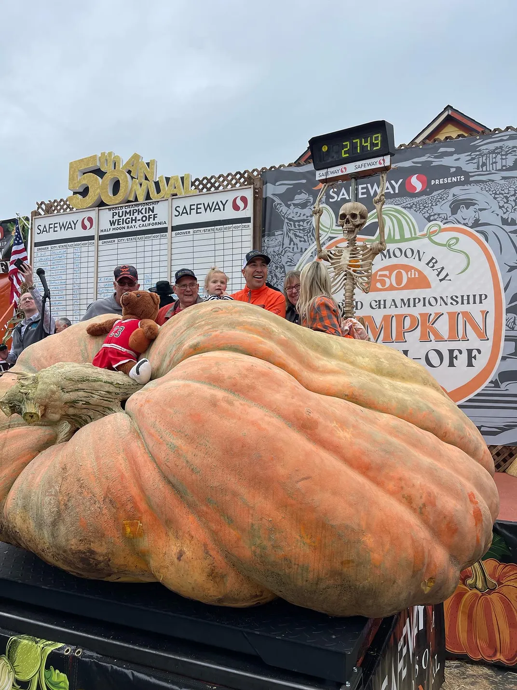

{width="708"}

```{r setup, include=FALSE}
knitr::opts_chunk$set(echo = TRUE)

# Call relevant packages to the work space: 
  library(leaflet)
  library(ggplot2)
  library(tidyverse)
  library(sf)
  #library(OpenStreetMap)

```

# Simple Map

```{r Simple Maps, echo=TRUE, message=FALSE, warning=FALSE}

# Load ggplot data using map_data command to begin simple map setup:
  state <- map_data("state")
  county <- map_data("county")
  utk <- data.frame("x" = -83.94057924, "y" = 35.947249271)

# Filter data to include Knox County, Tennessee:
  tn <- county %>% 
    filter(region=="tennessee")
  
  knoxco <- county %>% 
    filter(region=="tennessee") %>% 
    filter(subregion=="knox")

# Create a locator map for UTK:
  utk <- ggplot() + geom_polygon(data = state, aes(x=long, y = lat, group = group),
                          fill = "white", color="black") + 
             geom_polygon(data = tn, aes(x=long, y = lat, group = group),
                          fill = "lightgray", color="black") + 
             geom_polygon(data = knoxco, aes(x=long, y = lat, group = group),
                          fill = "orange", color="black") + 
             geom_point(data = utk, aes(x=x,y=y), color="black") +
    coord_fixed(xlim = c(-91, -81),  ylim = c(34.75, 37), ratio = 1.1) + 
    xlab("Longitude") + ylab("Latitude") + ggtitle("University of Tennessee, Knox County, TN")

# Display map as output: 
  utk
  
# Zoom in on it:
  state <- map_data("state")
  county <- map_data("county")
  utk <- data.frame("x" = -83.94057924, "y" = 35.947249271)
  
  tn <- county %>% 
    filter(region=="tennessee")
  
  knoxco <- county %>% 
    filter(region=="tennessee") %>% 
    filter(subregion=="knox")
  
  utk.zoom <- ggplot() + geom_polygon(data = state, aes(x=long, y = lat, group = group),
                          fill = "white", color="black") + 
             geom_polygon(data = tn, aes(x=long, y = lat, group = group),
                          fill = "lightgray", color="black") + 
             geom_polygon(data = knoxco, aes(x=long, y = lat, group = group),
                          fill = "orange", color="black") + 
             geom_point(data = utk, aes(x=x,y=y), color="black") +
    coord_fixed(xlim = c(-85, -82.5),  ylim = c(34.75, 37), ratio = 1.1) + 
    xlab("Longitude") + ylab("Latitude") + ggtitle("University of Tennessee, Knox County, TN")
  
# Display map as output:
  utk.zoom
  
```

# Interactive Leaflet Map

```{r Leaflet - Interactive Map, echo=TRUE, message=FALSE, warning=FALSE}

# Read in the data to use:
  utk.points <- read.csv("utk.csv")

# Make map: 
  utk.info <- leaflet(utk.points) %>% 
              addTiles() %>%
              addCircleMarkers(popup = utk.points$name,
                   label = utk.points$info,
                   lng = utk.points$x, 
                   lat = utk.points$y,
                   weight = 2,
                   color = "grey",
                   fillColor = "orange",
                   fillOpacity = 0.7)

  utk.info 
  
```

# Terrain and Elevation

```{r Leaflet - Terrain and Elevation, echo=TRUE, message=FALSE, warning=FALSE}

utk.terrain <- leaflet() %>% 
  setView(lng = -83.94057172656338, lat = 35.93541535701639, zoom = 15) %>%
  addWMSTiles("https://basemap.nationalmap.gov/arcgis/services/USGSTopo/MapServer/WmsServer", layers = "0") %>%
  addMiniMap(zoomLevelOffset = -4) %>%
  addScaleBar()

utk.terrain

```

# Fun fact:

The world's largest pumpkin weighs 2,749 and was grown by a man named Gienger... It's called Gienger's Gourd: 
 

You can read about it [here](https://www.smithsonianmag.com/smart-news/minnesota-mans-latest-giant-pumpkin-shatters-world-record-with-2749-pound-gourd-180983045/#:~:text=Weighing%20in%20at%202%2C749%20pounds,Minnesota%20Public%20Radio%20(MPR).)

And here is my favorite pumpkin: 

Here he is working on his map assignment: 


