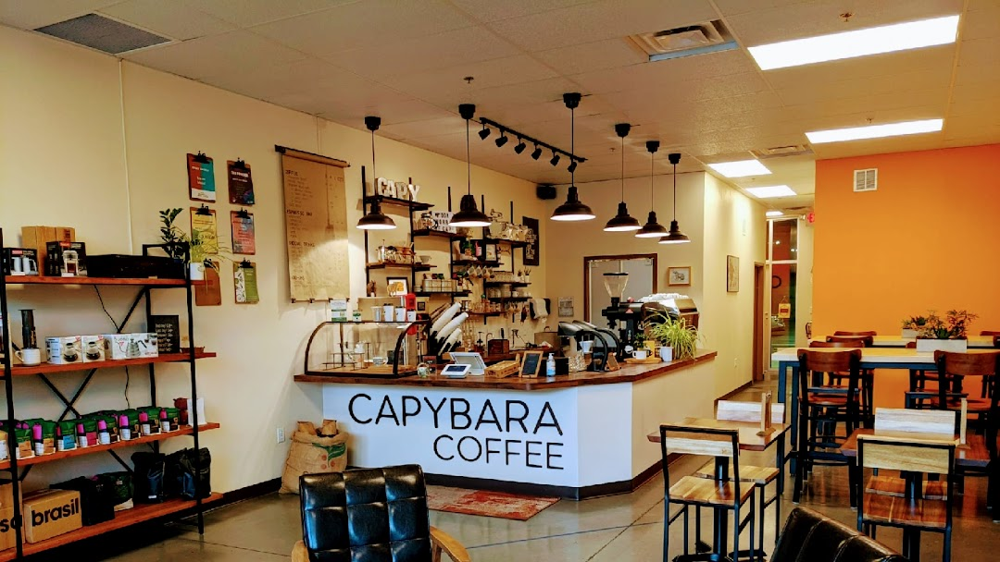

{width="809"}

```{r setup, include=FALSE}
knitr::opts_chunk$set(echo = TRUE)

# Call relevant packages to the work space: 
  pacman::p_load("leaflet","OpenStreetMap","sf","tidyverse", "ggplot2") 

```

# Simple Maps

```{r Simple Maps, echo=FALSE}

# Load ggplot data using map_data command to begin simple map setup:
  state <- map_data("state")
  county <- map_data("county")
  capybara <- data.frame("x" = -83.93983895, "y" = 35.95087543)

# Filter data to include Knox County, Tennessee:
  tn <- county %>% 
    filter(region=="tennessee")
  
  knoxco <- county %>% 
    filter(region=="tennessee") %>% 
    filter(subregion=="knox")

# Create a locator map for Capybara Coffee:
  capy <- ggplot() + geom_polygon(data = state, aes(x=long, y = lat, group = group),
                          fill = "white", color="black") + 
             geom_polygon(data = tn, aes(x=long, y = lat, group = group),
                          fill = "lavenderblush", color="black") + 
             geom_polygon(data = knoxco, aes(x=long, y = lat, group = group),
                          fill = "hotpink", color="black") + 
             geom_point(data = capybara, aes(x=x,y=y), color="black") +
    coord_fixed(xlim = c(-91, -81),  ylim = c(34.5, 37), ratio = 1.1) + 
    xlab("Longitude") + ylab("Latitude") + ggtitle("Capybara Coffee, Knox County, TN")

# Display map as output: 
  capy
  
```
